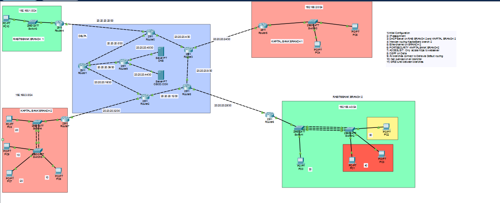
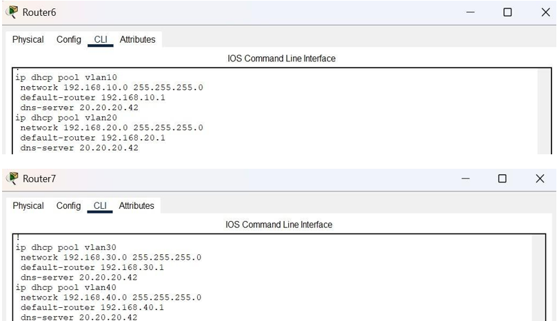
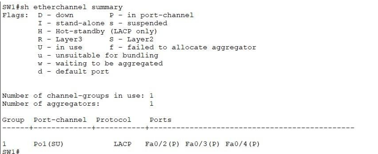
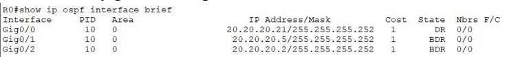
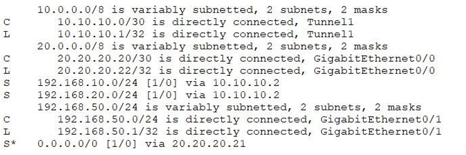
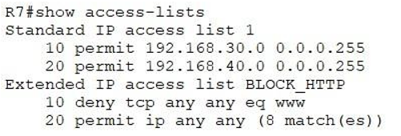
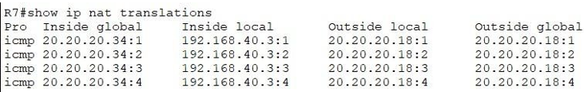
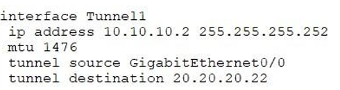

# Secure Multi-Branch Bank Network


A multi-branch banking network designed, configured and verified in **Cisco Packet Tracer**. Four bank branches connect to a central OSPF core ("Delta") and are hardened with access lists, port security, NAT, VLAN segmentation and a GRE tunnel.

The project is built with a **defender's mindset**: every control is paired with the evidence a SOC analyst would look at when monitoring or investigating the network.

---

## Table of Contents

- [Overview](#overview)
- [Skills Demonstrated](#skills-demonstrated)
- [Topology](#topology)
- [Requirements](#requirements)
- [Addressing](#addressing)
- [Implementation and Verification](#implementation-and-verification)
- [Security Controls](#security-controls)
- [Security Perspective (SOC View)](#security-perspective-soc-view)
- [Known Limitations](#known-limitations)
- [Roadmap](#roadmap)
- [How to Use This Lab](#how-to-use-this-lab)
- [Repository Contents](#repository-contents)
- [Author](#author)

---

## Overview

| Item | Details |
|------|---------|
| Scenario | Two banks, each with two branches, connected through a shared core |
| Core routing | OSPF (process 10, area 0) on the Delta network |
| Branch connectivity | Static default routes towards Delta |
| Remote access | SSH on Branch 1, Telnet on Branch 2 (to be replaced, see [Known Limitations](#known-limitations)) |
| Tool | Cisco Packet Tracer |

## Skills Demonstrated

- **Switching:** VLANs, trunking, LACP EtherChannel, port security
- **Routing:** inter-VLAN routing (router-on-a-stick), OSPF, static default routes
- **Network services:** DHCP, DNS, NAT overload
- **Security:** extended and standard ACLs, port security, device hardening, attack-surface reduction
- **Connectivity:** GRE tunnelling between branches
- **Security operations:** mapping each control to logs and evidence a SOC analyst would use

## Topology



## Requirements

| # | Requirement |
|---|-------------|
| 1 | Initial configuration (SSH on Branch 1, Telnet on Branch 2) |
| 2 | IP addressing between all devices |
| 3 | DHCP server on both bottom branches |
| 4 | Inter-VLAN routing on both bottom branches |
| 5 | EtherChannel (LACP) on Branch 2 |
| 6 | Port security on Kapital Bank Branch 2 |
| 7 | Extended ACL for web access control |
| 8 | OSPF on the Delta core |
| 9 | Default routing from all branches to Delta |
| 10 | NAT overload on all branches |
| 11 | GRE tunnel between branches |

## Addressing

| Network | Purpose |
|---------|---------|
| `192.168.10.0/24` (VLAN 10) | Branch LAN, DHCP on Router6 |
| `192.168.20.0/24` (VLAN 20) | Branch LAN, DHCP on Router6 |
| `192.168.30.0/24` (VLAN 30) | Branch LAN, DHCP on Router7 |
| `192.168.40.0/24` (VLAN 40) | Branch LAN, DHCP on Router7 |
| `192.168.50.0/24` | Branch LAN (static routing) |
| `20.20.20.0/24` (/30 links) | Delta core and branch uplinks |
| `10.10.10.0/30` | GRE tunnel |
| `20.20.20.42` | Internal DNS server |

## Implementation and Verification

Each feature below lists what was configured and the command used to verify it.

### 1. DHCP and DNS
DHCP pools per VLAN hand out an address, default gateway and the internal DNS server (`20.20.20.42`).

- Verify: `show ip dhcp binding`, `show ip dhcp pool`, and `ipconfig /all` on a client



### 2. EtherChannel (LACP)
A LACP EtherChannel (`Po1`) bundles three physical links between switches for bandwidth and redundancy.

- Verify: `show etherchannel summary`



### 3. OSPF
OSPF (process 10, area 0) runs across the Delta core routers.

- Verify: `show ip ospf neighbor`, `show ip route ospf`



### 4. Default Routing
Branches reach the core through static default routes (`0.0.0.0/0`).

- Verify: `show ip route`, then ping across branches



### 5. Access Control Lists
The extended ACL `BLOCK_HTTP` filters cleartext web traffic, and a standard ACL restricts which source networks are permitted.

- Verify: `show access-lists` (check the match counters), and test from a client browser



### 6. NAT Overload (PAT)
Private branch addresses are translated to a single public address.

- Verify: `show ip nat translations`, `show ip nat statistics`



### 7. GRE Tunnel
A point-to-point GRE tunnel (`10.10.10.0/30`) links the branch routers.

- Verify: `show interfaces tunnel 0`, then ping across the tunnel



## Security Controls

| Control | Purpose |
|---------|---------|
| Port security (sticky MAC, violation `shutdown`) | Prevents unauthorized devices on access ports |
| Unused ports shut down | Reduces physical attack surface |
| CDP disabled | Avoids leaking device information |
| `switchport nonegotiate` on trunks | Blocks DTP-based VLAN hopping |
| Extended ACL | Restricts web access |
| NAT overload | Conceals internal addressing from external networks (this is address obscuring, not a substitute for a firewall) |
| VLAN segmentation | Separates traffic between departments |

## Security Perspective (SOC View)

Each control above produces evidence an analyst can use:

| Source | What it tells the analyst |
|--------|---------------------------|
| **Port security violations** | Syslog messages and an err-disabled port point to a rogue or unknown device |
| **ACL deny hits** | Blocked connection attempts can reveal scanning or policy misuse |
| **NAT translation table** | Maps internal hosts to public addresses, essential for tracing an incident back to a source machine |
| **GRE traffic** | Encapsulated, so inspection requires analysing both the outer and inner headers |
| **OSPF neighbor changes** | May indicate link failures or a rogue router |
| **DHCP bindings** | Link an IP address and MAC address to a time window during an investigation |

## Known Limitations

Documented honestly as part of the learning process, each with a planned fix:

| Limitation | Risk | Planned fix |
|------------|------|-------------|
| **Telnet on Branch 2** | Credentials travel in cleartext | Replace with SSH and restrict VTY access with an ACL |
| **ACL scope** | The current ACL blocks HTTP but permits everything else | Allow only HTTPS (TCP 443) to the web server, with a logging deny rule |
| **GRE is not encrypted** | Tunnel traffic can be read in transit | Protect the tunnel with IPsec |
| **OSPF without authentication** | A rogue router could inject routes | Enable OSPF authentication |
| **Weak lab passwords** (e.g. `test123`) | Trivial to guess | Lab use only; use strong secrets and `service password-encryption` in production |
| **Simulation only** | Packet Tracer does not fully replicate real device behavior or advanced security features | Validate the design on real hardware or GNS3/EVE-NG where possible |

## Roadmap

- [ ] Add full device configurations (`configs/` folder)
- [ ] Replace Telnet with SSH on Branch 2
- [ ] Tighten the ACL to HTTPS-only with logging
- [ ] Add IPsec protection to the GRE tunnel
- [ ] Enable OSPF authentication
- [ ] Add syslog forwarding and log analysis with a SIEM

## How to Use This Lab

1. Install [Cisco Packet Tracer](https://www.netacad.com/cisco-packet-tracer).
2. Clone the repository:
```bash
   git clone https://github.com/<your-username>/<repo-name>.git
```
3. Open `secure-multi-branch-bank-network.pkt` in Packet Tracer.
4. Use the verification commands in each section above to confirm the behavior.

## Repository Contents

| File | Description |
|------|-------------|
| `secure-multi-branch-bank-network.pkt` | Packet Tracer lab file |
| `topology.png` | Network topology |
| `*.png` | Verification screenshots |

## Author

**Ali Mustafayev**
[LinkedIn](https://www.linkedin.com/in/ali-mustafayev1)
